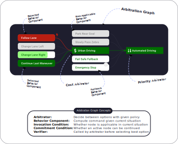
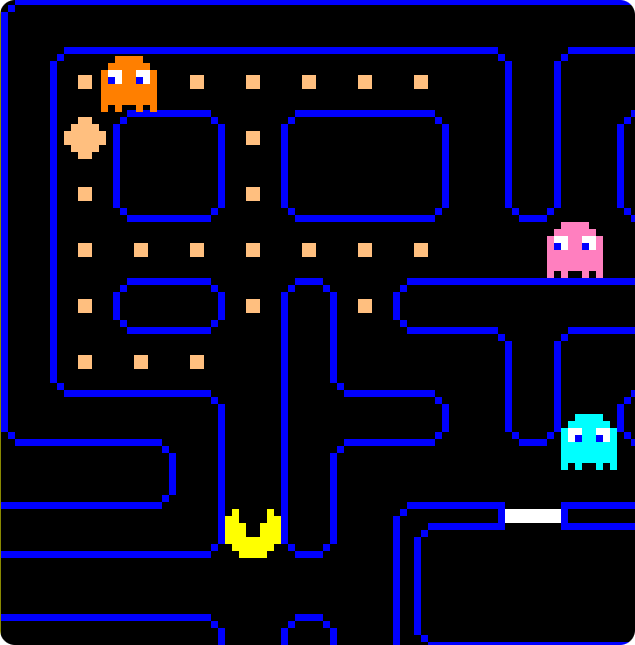
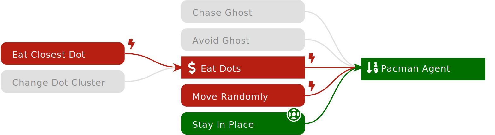

# Arbitration Graphs

[](https://github.com/KIT-MRT/arbitration_graphs/releases)
[](./LICENSE)
[](https://github.com/KIT-MRT/arbitration_graphs/actions/workflows/run-unit-tests.yaml?query=branch%3Amain)

*TL;DR: Replace those rusty state machines with safe and scalable arbitration graphs!*

**Hierarchical behavior models for complex decision-making and behavior generation in robotics!**

- 🌱 **Bottom-up**  
  Combine simple atomic behavior components to generate complex behaviors.
- 🧩 **Functional decomposition**  
  Behavior components address *How to do it?* and *Can we do it?*, while Arbitrators decide *What to do?*
 - 🧠 **Meta-framework**  
  Integrate diverse methods in one decision-making framework. Why not combine optimization-based planning, probabilistic approaches (POMDPs), and machine learning (RL)? Use any approach where it performs best!
- 🛠️ **Maintainability**  
  Add new behaviors without having to touch existing ones – did we mention strict modularity and functional decomposition?
- 🛡️ **Behavior Verification**  
  Use tightly integrated verifiers to ensure that only safe and valid behavior commands are executed.
- 🪂 **Graceful Degradation**  
  Your behavior is unreliable or unsafe? Arbitrators will gracefully fall back to the next-best option.


<details>
<summary>😋 Click for more reasons!</summary>

- 📈 **Scalability**  
  Stack behavior components in arbitrators to create hierarchical behavior models.
- 💡 **Transparency**  
  Easily follow and understand the decision-making process, e.g., with our GUI.
- 📦 **Header-Only**  
  Simple integration – just include this header-only C++17 library!
- 🐍 **Python Bindings**  
  For easy prototyping, testing, and integration of machine learning algorithms, all the functionality is available via Python bindings.
- 📜 **Permissive License**  
  Published under MIT license to ensure maximum flexibility for your projects.

</details>


<details>
<summary>🤨 How does it compare to Behavior Trees?</summary>

Behavior Trees (BTs) are great for a variety of applications and thrive within a vibrant community!  
Kudos to [Petter Ögren's](https://www.kth.se/profile/petter/) crew, [Michele Colledanchise](https://miccol.github.io/behaviortrees/) and [Davide Faconti](https://github.com/facontidavide) 🖖

But, Arbitration Graphs bring great value, especially for safety critical applications like self-driving cars and mobile robots in general – by strictly coupling preconditions to behaviors and tightly integrating behavior verification.
A bit more in detail:

|                   | Behavior Trees                                                                                                                 | Arbitration Graphs                                                                                                                                                                                                    |
| ----------------- | ------------------------------------------------------------------------------------------------------------------------------ | --------------------------------------------------------------------------------------------------------------------------------------------------------------------------------------------------------------------- |
| **Interfaces**    | Nodes return execution status (*success*, *failure*, or *running*). <br>⏵ more flexibility w.r.t. a node's actuator interfaces | Behavior components & arbitrators return commands (e.g., a trajectory). <br>⏵ control theory motivated interface ${f(\boldsymbol{x}) \to \boldsymbol{u}}$ <br>⏵ command can be verified by each arbitrator            |
| **Preconditions** | Implemented by condition nodes distributed throughout the tree. <br>⏵ easy to reuse preconditions for multiple behaviors       | Require behavior components to define their own preconditions. <br>⏵ tight coupling of preconditions to behaviors <br>⏵ robustness and safety less dependent on node arrangement                                      |
| **Safety**        | Each node decides on its success or failure. <br>⏵ can lead to safety and reliability issues, if not carefully managed         | Integrate safety into the selection mechanism, using node-independent verifiers. <br>⏵ reduces the burden on behavior engineers <br>⏵ allows an easy integration of unsafe behavior components (ML, probabilistic, …) |

</details>

## At a Glance

**Arbitration Graphs** break down complex decision-making into atomic behavior components and arbitrators.

**Behavior components** compute a command (e.g., a trajectory) based on the current state of the world.
They define whether they can be executed in the current state using their invocation condition.

**Arbitrators** select the best option based on a defined decision-making policy.
Options can be behavior components or nested arbitrators.

**Verifiers** check whether the command of a behavior component is safe and valid prior to being selected by an arbitrator.

<p align="center">
  
</p>


## Demo

We provide a demo of this library using Pac-Man as an example application.  
The arbitration graph controls Pac-Man on its journey to collect tasty dots 🍬

Run the demo with:

```bash
git clone https://github.com/KIT-MRT/arbitration_graphs.git
cd arbitration_graphs/demo
docker compose up
```

Open the GUI with your favorite browser:  
[http://0.0.0.0:8080](http://0.0.0.0:8080)

### Explanation

You will see the *Pacman Agent* arbitrator selecting between five behavior options (by priority).  
The *Eat Dots* option is itself an arbitrator with two sub-behaviors (selecting by expected benefit).

In this scene,
- the *Chase Ghost* and *Avoid Ghost* behaviors are not applicable (no ghosts in close vicinity) → grey background,
- the *Eat Closest Dot* and *Move Randomly* behavior failed verification (our verification showcase) → red background,
- thus, the least-prioritized *Stay in Place* behavior is being executed → green background.

<p align="center">
  
</p>
<p align="center">
   
</p>


## Tutorial

Follow our [Tutorial](https://kit-mrt.github.io/arbitration_graphs/docs/Tutorial) and learn how to use the Arbitration Graphs library!  
It's based on this demo and guides you through all important concepts:

1. [Introduction – start here!](https://kit-mrt.github.io/arbitration_graphs/docs/Tutorial)
2. [Implement your first behavior component](https://kit-mrt.github.io/arbitration_graphs/docs/tasks/1_implement_behavior_component)
3. [Extend the arbitration graph with that behavior](https://kit-mrt.github.io/arbitration_graphs/docs/tasks/2_extend_arbitration_graph)
4. [Learn about nested arbitration graphs](https://kit-mrt.github.io/arbitration_graphs/docs/tasks/3_nested_arbitrators)
5. [Arbitrate based on predicted utility](https://kit-mrt.github.io/arbitration_graphs/docs/tasks/4_cost_arbitration)
6. [Verify commands and add a fallback strategy](https://kit-mrt.github.io/arbitration_graphs/docs/tasks/5_verification)


## Installation

The `arbitration_graphs` library consists of two parts
- **Core**  
  This is what it's all about – base classes for arbitrators and behavior components, implementations of various arbitration schemes, behavior verification, …
- **GUI** *optional*  
  Draws a live visual representation of the arbitration state (full graph, currently active behavior, current costs of behaviors, …) in a WebApp GUI. Supports SVG export as the one above (great for publications).

<details>
<summary>Prerequisites</summary>

First make sure all dependencies are installed:
- [glog](https://github.com/google/glog)
- [util_caching](https://github.com/KIT-MRT/util_caching)
- [yaml-cpp](https://github.com/jbeder/yaml-cpp)
- [Googletest](https://github.com/google/googletest) (optional, if you want to build unit tests)
- [Crow](https://crowcpp.org) (optional, needed for GUI only)

See also the [`Dockerfile`](./Dockerfile) for how to install these packages under Debian or Ubuntu.
</details>

<details>
<summary>Installation using Debian package (recommended)</summary>

We provide a Debian package for easy installation on Debian-based distributions.
Download the latest `.deb` packages for the [core library](https://github.com/KIT-MRT/arbitration_graphs/releases/latest/download/libarbitration-graphs-core-dev.deb)
and optionally for [the gui](https://github.com/KIT-MRT/arbitration_graphs/releases/latest/download/libarbitration-graphs-gui-dev.deb) install them with `dpkg`:

```bash
sudo dpkg -i libarbitration-graphs-core-dev.deb
sudo dpkg -i libarbitration-graphs-gui-dev.deb
```
</details>

<details>
<summary>Installation from .zip/.tar.gz</summary>

As this is a header-only library, no platform-specific compilation is needed.
So, you can also install the files directly from our release [`.zip` or `.tar.gz` archives](https://github.com/KIT-MRT/arbitration_graphs/releases/latest):

```bash
tar xf arbitration_graphs-core.tar.gz --directory=/
tar xf arbitration_graphs-gui.tar.gz --directory=/
```

This installs into `/usr/[include,lib,share]/arbitration_graphs`.
Please read [Serving the WebApp GUI](#serving-the-webapp-gui) below, if you consider custom installation paths and want to use the GUI.

</details> 

<details>
<summary>Using Docker image with pre-installed library</summary>

We provide a Docker image with the library and all dependencies already installed globally.

```bash
docker pull ghcr.io/kit-mrt/arbitration_graphs
```

The library is located under `/usr/local/include/arbitration_graphs/` and `/usr/local/lib/cmake/arbitration_graphs/`.
So, it can be easily loaded with CMake:

```cmake
find_package(arbitration_graphs REQUIRED)
```

</details>

<details>
<summary>Building from source using CMake</summary>

Clone the repository:

```bash
git clone https://github.com/KIT-MRT/arbitration_graphs.git
cd arbitration_graphs
```

Compile and install the project with CMake:

```bash
mkdir -p arbitration_graphs/build
cd arbitration_graphs/build
cmake ..
cmake --build .
sudo cmake --install .
```

In order to skip compiling the GUI, use `cmake -DBUILD_GUI=false ..` instead.

</details>

## Python Bindings

The library provides a Python interface via [pybind11](https://pybind11.readthedocs.io).
See [`python_bindings/README.md`](python_bindings/README.md) for details on how to install and use the arbitration_graphs Python package.

## Development

<details>
<summary>Using Docker image</summary>

Clone the repository and run the development image

```bash
git clone https://github.com/KIT-MRT/arbitration_graphs.git
cd arbitration_graphs
docker compose build
docker compose run --rm arbitration_graphs_devel
```

This mounts the source into the container's `/home/blinky/arbitration_graphs` folder.
There, you can edit the source code, compile and run the tests etc.

</details>


<details>
<summary>Compiling unit tests</summary>

In order to compile with tests define `BUILD_TESTS=true`
```bash
mkdir -p arbitration_graphs/build
cd arbitration_graphs/build
cmake -DBUILD_TESTS=true ..
cmake --build . -j9
```

Run all unit tests with CTest:

```bash
cmake --build . --target test
```

</details>


<details>
<summary>Serving the WebApp GUI</summary>

The GUI consists of
- a web server with static WebApp files, see [`gui/app`](./gui/app)
- a websocket server providing the arbitration graph state to the WebApp

In order to serve the WebApp files, their location must be known to the executable running the web server.
By default (and without further setup), we support these locations:
- the install path, i.e. `/opt/share/arbitration_graphs`
- the current source path for local builds, i.e. `/home/blinky/arbitration_graphs/gui/app/arbitration_graphs` (only works, if no installation has been found)

If you intend to override these, please use the `APP_DIRECTORY` environment variable to define the WebApp path:

```
APP_DIRECTORY=/my/custom/app/path my_awesome_executable
```

</details>


## Contributors

This library and repo has been crafted with ❤️ by

**Christoph Burger**
&nbsp;
<a href="https://github.com/ChristophBurger89" aria-label="View GitHub profile">
  
  ChristophBurger89
</a>
&nbsp;
<a href="https://www.linkedin.com/in/christoph-burger" aria-label="View LinkedIn profile">
  
  christoph-burger
</a>
&nbsp;
<a href="https://orcid.org/0009-0002-9147-8749" aria-label="View ORCID record">
  
  0009-0002-9147-8749
</a><br>
**Nick Le Large**
&nbsp;
<a href="https://github.com/ll-nick" aria-label="View GitHub profile">
  
  ll-nick
</a>
&nbsp;
<a href="https://www.linkedin.com/in/nick-le-large" aria-label="View LinkedIn profile">
  
  nick-le-large
</a>
&nbsp;
<a href="https://orcid.org/0009-0006-5191-9043" aria-label="View ORCID record">
  
  0009-0006-5191-9043
</a><br>
**Piotr Spieker**
&nbsp;
<a href="https://github.com/orzechow" aria-label="View GitHub profile">
  
  orzechow
</a>
&nbsp;
<a href="https://www.linkedin.com/in/piotr-spieker" aria-label="View LinkedIn profile">
  
  piotr-spieker
</a>
&nbsp;
<a href="https://orcid.org/0000-0002-0449-3741" aria-label="View ORCID record">
  
  0000-0002-0449-3741
</a>

Christoph and Piotr coded the core in a pair-programming session.
Piotr also contributed the GUI and GitHub Page.
Nick implemented the awesome PacMan demo and tutorial, with drafting support by Christoph, reviews and finetuning by Piotr.

The repository is maintained by Piotr Spieker&nbsp;
<a href="https://github.com/orzechow" aria-label="View GitHub profile">
  
  orzechow
</a>
and
Nick Le Large&nbsp;
<a href="https://github.com/ll-nick" aria-label="View GitHub profile">
  
  ll-nick
</a>.


## Citation

If you use arbitration graphs in your research, we would be pleased if you cite our work:

*Piotr Spieker, Nick Le Large, and Martin Lauer, “Better Safe Than Sorry: Enhancing Arbitration Graphs for Safe and Robust Autonomous Decision-Making,” Nov. 15, 2024, arXiv: arXiv:2411.10170. doi: [10.48550/arXiv.2411.10170](https://doi.org/10.48550/arXiv.2411.10170).*

```bibtex
@misc{spieker2024ArbitrationGraphs,
  title={Better Safe Than Sorry: Enhancing Arbitration Graphs for Safe and Robust Autonomous Decision-Making}, 
  author={Piotr Spieker and Nick Le Large and Martin Lauer},
  year={2024},
  eprint={2411.10170},
  eprinttype = {arXiv},
  archivePrefix={arXiv},
  primaryClass={cs.RO},
  doi = {10.48550/arXiv.2411.10170},
  url={https://arxiv.org/abs/2411.10170}, 
}
```


<details>
<summary>Earlier publications</summary>

### Behavior Verification and Fallback Layers
A safety concept that extends Arbitration Graphs with behavior verification and fallback layers in the context of automated driving has been proposed by Piotr Spieker (née Orzechowski) in his PhD thesis.
This served as the basis for the paper with Nick above.

_Piotr F. Orzechowski, “Verhaltensentscheidung für automatisierte Fahrzeuge mittels Arbitrationsgraphen,” phd, Karlsruher Institut für Technologie (KIT), 2023. doi: [10.5445/IR/1000160638](https://doi.org/10.5445/IR/1000160638)._

```bibtex
@thesis{Orzechowski2023Arbitrationsgraphen,
  type = {phdthesis},
  title = {Verhaltensentscheidung für automatisierte Fahrzeuge mittels Arbitrationsgraphen},
  author = {Orzechowski, Piotr Franciszek},
  date = {2023},
  institution = {Karlsruher Institut für Technologie (KIT)},
  doi = {10.5445/IR/1000160638},
  langid = {german},
  pagetotal = {169},
}
```

### Replacing state machines in AV
Arbitration Graphs replaced state machines in the context of automated driving at the Institute of Measurement and Control Systems (MRT) of the Karlsruhe Institute of Technology (KIT):

_Piotr F. Orzechowski, Christoph Burger, and Martin Lauer, “Decision-Making for Automated Vehicles Using a Hierarchical Behavior-Based Arbitration Scheme,” in Intelligent Vehicles Symposium, Las Vegas, NV, USA: IEEE, Oct. 2020, pp. 767–774. doi: [10.1109/IV47402.2020.9304723](https://doi.org/10.1109/IV47402.2020.9304723)._

```bibtex
@inproceedings{orzechowski2020ArbitrationGraphs,
  title = {Decision-Making for Automated Vehicles Using a Hierarchical Behavior-Based Arbitration Scheme},
  booktitle = {Intelligent Vehicles Symposium},
  author = {Orzechowski, Piotr F. and Burger, Christoph and Lauer, Martin},
  date = {2020-10},
  pages = {767--774},
  publisher = {IEEE},
  location = {Las Vegas, NV, USA},
  issn = {2642-7214},
  doi = {10.1109/IV47402.2020.9304723},
}
```

### Foundation work in Robot Soccer
The foundations for Arbitration Graphs have been proposed in the context of robot soccer:

_Martin Lauer, Roland Hafner, Sascha Lange, and Martin Riedmiller, “Cognitive concepts in autonomous soccer playing robots,” Cognitive Systems Research, vol. 11, no. 3, pp. 287–309, 2010, doi: [10.1016/j.cogsys.2009.12.003](https://doi.org/10.1016/j.cogsys.2009.12.003)._

```bibtex
@article{lauer2010CognitiveConceptsAutonomous,
  title = {Cognitive Concepts in Autonomous Soccer Playing Robots},
  author = {Lauer, Martin and Hafner, Roland and Lange, Sascha and Riedmiller, Martin},
  date = {2010},
  journaltitle = {Cognitive Systems Research},
  volume = {11},
  number = {3},
  pages = {287--309},
  doi = {10.1016/j.cogsys.2009.12.003},
}
```

</details>
