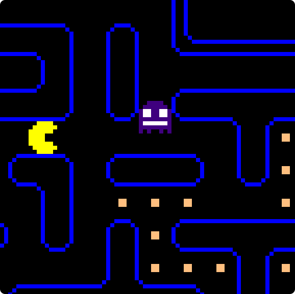

# Task 1: Implement a Behavior Component

Implement your first `checkInvocationCondition()` and `getCommand()` function, such that the ChaseGhost behavior component passes its unit tests.

<p align="center">
   
</p>

## Context

Before we start building our arbitration graph, we want to take a closer look into behavior components.
Don't worry, most of the behavior components are already implemented for you
  but we want to make sure you have an idea of how they work.

With the current state of the arbitration graph, Pac-Man will just move around and eat dots until a ghost gets too close.
That's great and all but if we ate a power pellet, we want to take advantage and chase the ghosts to eat them for extra points!

To do this, we need to implement the `ChaseGhost` behavior component.
It essentially does the exact opposite of the `AvoidGhost` behavior component
  but is only applicable when Pac-Man ate a power pellet.
We can ensure that this is always the case by using the behavior's invocation condition.

But wait - the current implementation of the invocation condition is not complete.
It should only be applicable if there is one of these tasty ghosts close by.

Once that's out of the way, we'll take a closer look at the `getCommand()` function which is missing some core logic right now.

## Goal

Finish the implementation of the `checkInvocationCondition()` and `getCommand()` functions
  of the `ChaseGhost` behavior component such that it passes its unit tests.

## Instructions

- Build and run the game, take a look at the arbitration graph and observe how Pac-Man behaves.
- Run the unit tests and note that the `ChaseGhost`'s `checkInvocationConditionFalse` test is failing
- Open the implementation of the `ChaseGhost` behavior component in `src/chase_ghost_behavior.cpp`.
- The `checkInvocationCondition()` function is already implemented but does not check for the presence of a ghost.
- Implement the missing piece. Take a look at the implementation of `AvoidGhostBehavior::checkInvocationCondition()` if you need inspiration.
- The `getCommand()` function is partially implemented but the core logic is missing.
- Implement the missing piece. Take a look at the implementation of `AvoidGhostBehavior::getCommand()` if you need inspiration.
- Compile and run the unit tests for the `ChaseGhost` behavior component to verify that your implementation is correct.

## Solution

<details>
<summary>Click here to expand the solution</summary>

Fix the invocation condition in `src/chase_ghost_behavior.cpp`:
```cpp
bool ChaseGhostBehavior::checkInvocationCondition(const Time& time) const {
    return environmentModel_->closestScaredGhost(time).has_value() &&
           environmentModel_->closestScaredGhost(time)->ghost.scaredCountdown > parameters_.minScaredTicksLeft &&
           environmentModel_->closestScaredGhost(time)->distance < parameters_.invocationMinDistance; // Only applicable if a ghost is close by
}
```

Add the missing piece of the `getCommand()` function in `src/chase_ghost_behavior.cpp`:
```cpp
Command ChaseGhostBehavior::getCommand(const Time& time) {
    auto pacmanPosition = environmentModel_->pacmanPosition();

    auto closestScaredGhost = environmentModel_->closestScaredGhost(time);
    if (!closestScaredGhost) {
        throw std::runtime_error("Can not compute command to chase ghost because there are no scared ghosts.");
    }

    auto ghostPosition = closestScaredGhost->ghost.position;

    std::optional<Direction> direction;

    // Add this part:
    // Chose the direction moving pacman towards the closest scared ghost
    double minDistance = std::numeric_limits<double>::max();
    for (const auto& move : Move::possibleMoves()) {
        auto nextPosition = environmentModel_->positionConsideringTunnel(pacmanPosition + move.deltaPosition);

        if (environmentModel_->isWall(nextPosition)) {
            continue;
        }

        // Chose the direction moving pacman towards the closest scared ghost (considering ghost movement)
        auto nextDistance = environmentModel_->mazeDistance(nextPosition, ghostPosition);
        if (nextDistance < minDistance) {
            direction = move.direction;
            minDistance = nextDistance;
        }
    }

    if (!direction) {
        throw std::runtime_error("Failed to compute direction to chase the closest ghost.");
    }

    return Command{direction.value()};
}

```
</details>


---
[Tutorial Home](../Tutorial.md)
|
[Next task →](2_extend_arbitration_graph.md)
