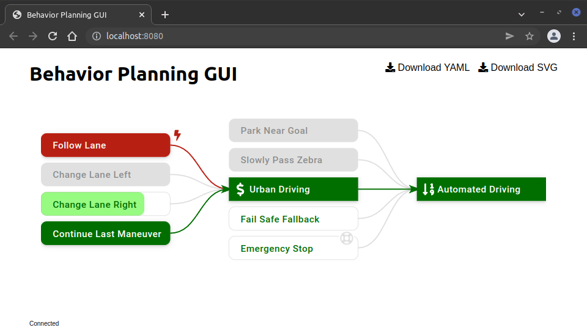

# BEHAVIOR PLANNING GUI

This package provides a graphical user interface for the arbitration graphs in [behavior_planning](https://gitlab.mrt.uni-karlsruhe.de/MRT/draft/behavior_planning).
It can be used to display the state of an arbitration graph offline by uploading a YAML file or in real-time using web sockets.
The displayed graph can be downloaded as YAML or SVG file.

The GUI is implemented as Web Application using [Vue.js](https://vuejs.org/).

## Usage

TODO: Explain how to launch the GUI.
